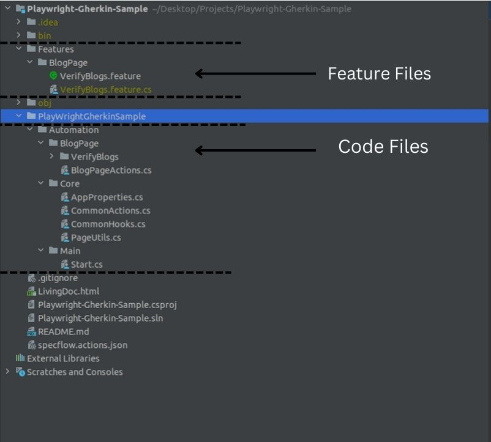

# Playwright-Gherkin-Sample

Our Structure Mainly Depended on these four file

1. Feature - Where the gherkin steps for a multiple features is mentioned, The structure break down like this 
 
 - Features (Folder) - The Base folder
    
    - PageName (Folder) - The folder for the pages you want to write test case on.
        
        - PageFeature.Feature (File) - This will include `Gherkin` steps for multiple feature and the feature can have multiple scenarios as one page can have more than 1 test case.

            - What is feature file - Your web page can have multiple feature lets for example take login page, A login page   have multiple features like Login User, Register User, Forgot Password. These can be described as features.

            - What is scenarios in feature - Now for scenario take Login User as feature and now this can have multiple scenario taken an example 'Successful User Authentication' described as one scenario and 'Failed User Authentication' can be described as another scenario, in short all the possible response that Login User can provide will be described as scenarios of the feature.

            Below is a Gherkin Steps examples for Login User Feature 

            ```
            Feature: Login User

            Scenario: Succesfull User Authentication

             Given   we are on the Login page
             When    we type in 'admin' in `User Name` textbox
             And     we type in 'admin@1234' in `Password` textbox
             And     we click on the `Sign in` button
             Then     we should navigate to the Main page 


            Scenario: Failed User Authentication

             Given   we are on the Login page
             When    we type in 'admin' in `User Name` textbox
             And     we type in 'admin@65757' in `Password` textbox
             And     we click on the `Sign in` button
             Then    `User name or password are incorrect` error message should display
            
            ```

            Both of these scenarios will be considered as separate test cases, One test case for successful authentication and one for failed.

2. Steps And Actions - Where the code related to all `Gherkin` steps are written, The structure break down like this 
    - Automation (Folder) - The Base folder for all automation code
        
        - PageName (Folder) - The Folder for automation code of that particular Page.
           
            - PageActions.cs (File) - The file will contain the code to perform actions on that page like click on button, enter the text etc. This PageAction file will be shared across multiple Features since some operation might be common within multiple feature.

            - PageFeature (Folder) - This folder name should be exact same as the. Feature file, so it will be mapped to this directory.
                
                - PageFeatureSteps.cs (File) - This file name should be exact same as the. Feature file so the gherkin steps will be mapped to this code file. This file will include code for the gherkin steps and the steps name should be exact same as written in .Feature file so the step code will be mapped. Each step will have separate method.

                Below code example for the steps file let consider Login User as feature

                ```
                    public sealed class LoginUserSteps
                    {
                        private IPage _page;
                        private PageActions _pageActions;

                        public AuthenticationSteps(IPage page)
                        {           
                            _page = page;
                            _pageActions = new PageActions(page);
                        }

                        [Given(@"we are on the Login page")]
                        public async Task GivenWeAreOnTheLoginPage()
                        {
                             await _page.GotoAsync(consoleUrl);
                        }

                        [When(@"we type in '(.*)' in `User Name` textbox")]
                        public async Task WhenWeTypeInUsername(string username)
                        {
                            await _pageActions.EnterUsername(username);
                        }
                    }
                
                ``` 

                As shown in the above example the steps will be mapped this code and the operation written inside method will be executed.

3. Hooks - Hooks (event bindings) can be used to perform additional automation logic at specific times. There are two main methods in this File `BeforeScenario` and `AfterScenario`. This file will be called before a test case execution starts and also after the test execution is completed doesn't matter if the test case is passed or failed. Which `url` will we go first before the test execution starts will be loaded in the `BeforeScenario` method and also if any additional operations to be performed before test execution starts and also `AfterScenario` method which will include operations you have to perform after execution is completed by the way `AfterScenario` is optional, Only `BeforeScenario` is madnatory.

Below is the image of simple structure we use -



4. Reports - The main file for which all these operations will be performed, We use a dotnet tool named `livingdoc` to generate the report, It comes in .html format an example file is included in this project.

Download the livingdoc tool using this command - 
```
dotnet tool install -g SpecFlow.Plus.LivingDoc.CLI
```

Steps to generate a report -

1. Run all test cases using this command inside the project structure - 

```
dotnet test
```
this will run all the scenarios of all feature files.

Additional if you just have to run some particular scenario or feature below commands can be used - 

To run just a single feature file

```
dotnet test --filer "FeaturFileName"
```

To just run selected scenarios of multiple a feature file

```
dotnet test --filter "FullyQualifiedName~ScenarioName|FullyQualifiedName~ScenarioName"
```

2. After execution is completed use this command to generate report

```
sudo /root/.dotnet/tools/livingdoc test-assembly bin/Debug/net6.0/Playwright-Gherkin-Sample.dll -t bin/Debug/net6.0/TestExecution.json
```
`TestExecution.json` file always generate automatically as soon as test execution is completed based on json file the report file is generated name `LivingDoc.html`

Below are the images of how report looks - 

.png)

.png)

